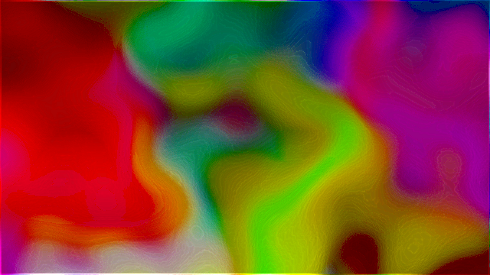
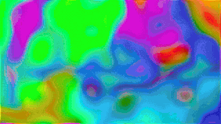
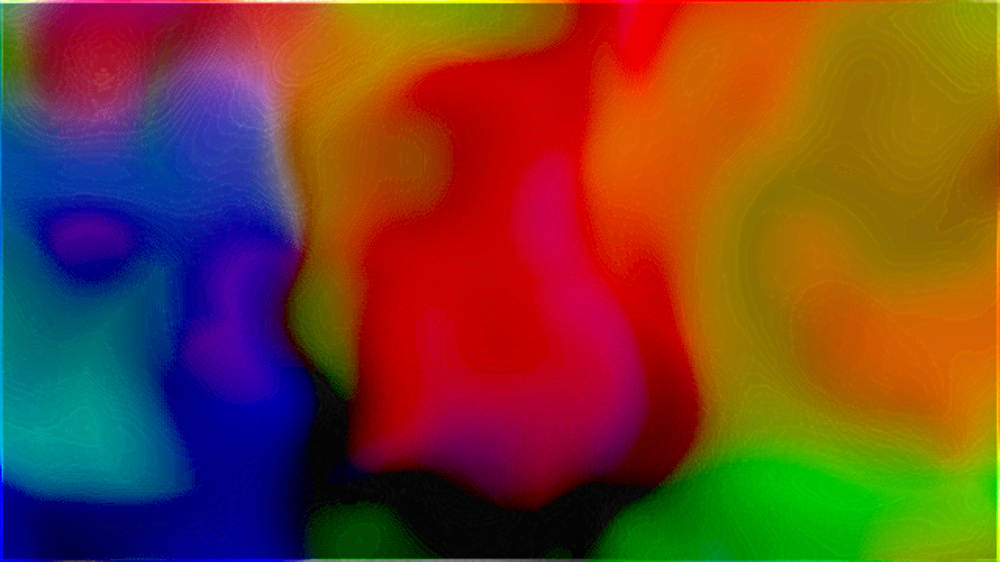
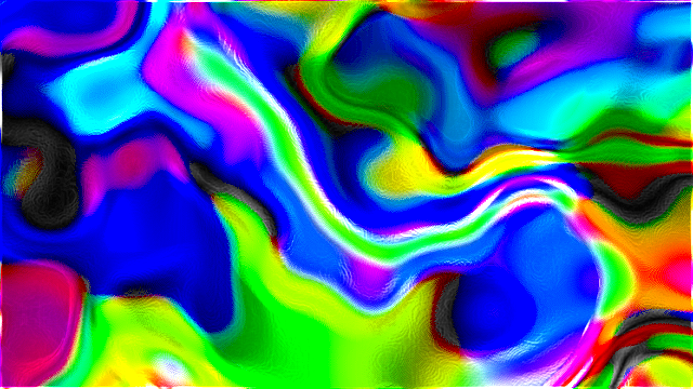
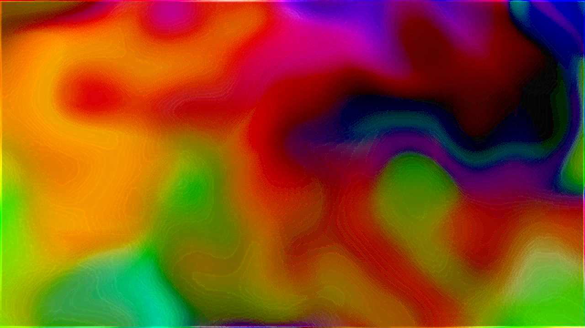
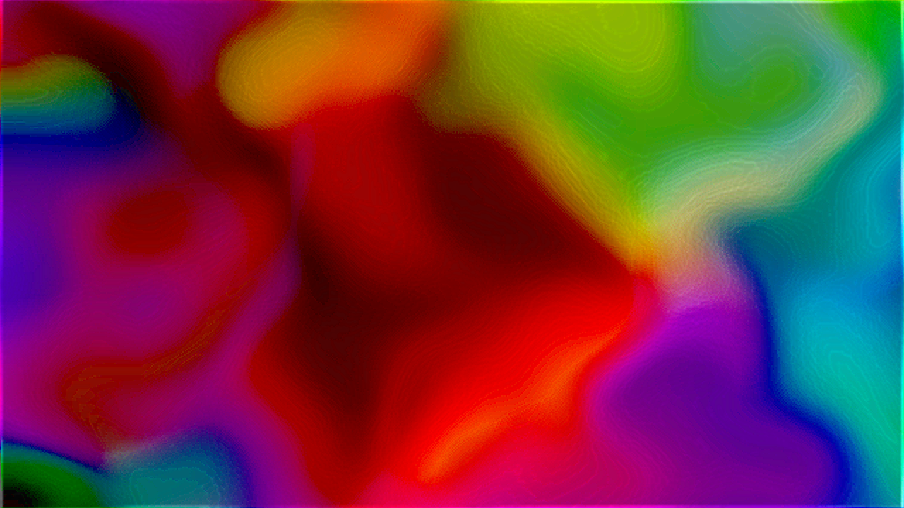
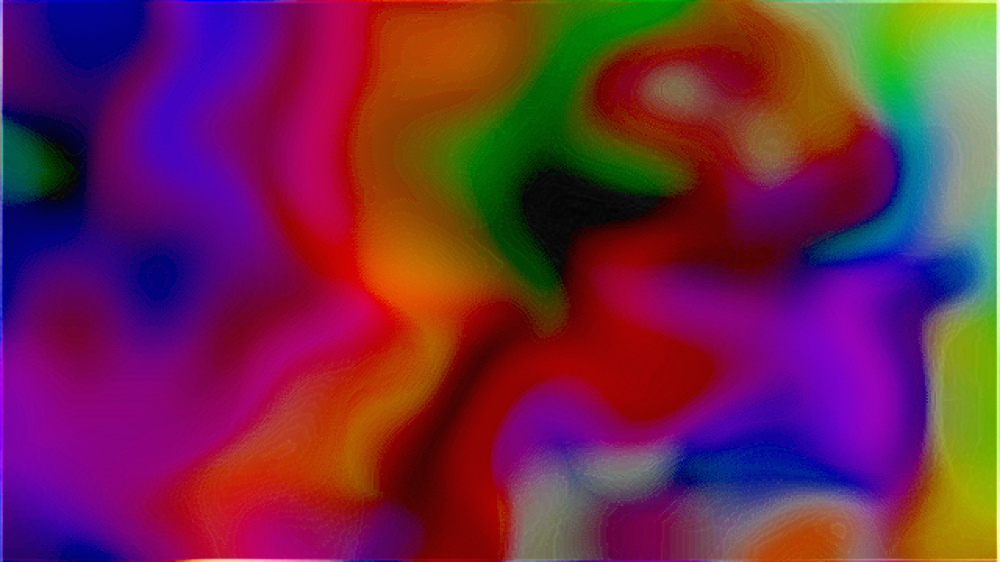
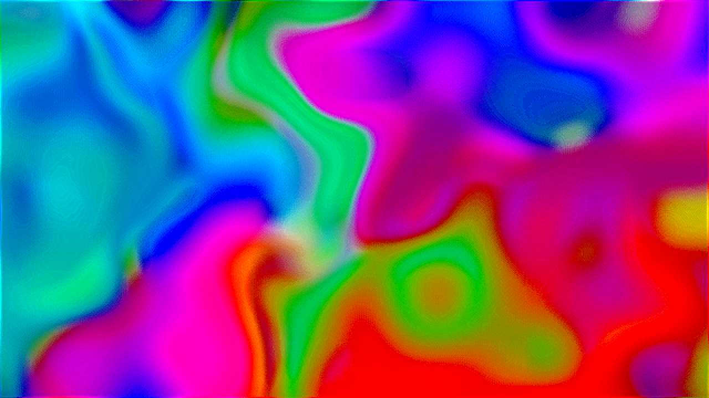
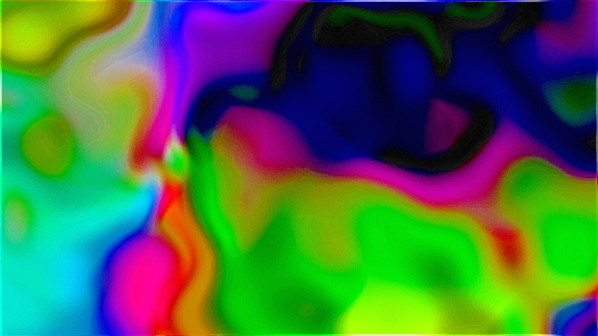

# TD Organic Patterns

TouchDesigner でフィードバックループ＋ドメインワープにより、油膜・大理石状の
有機的な虹色パターンを生成するネットワーク。

Reddit r/TouchDesigner の投稿
[organic patterns ⚗️](https://www.reddit.com/r/TouchDesigner/comments/1w3danp/organic_patterns/)
（作者: photoevaporation）の質感を、作者本人がコメントで明かした技法をもとに
TouchDesigner 標準ノードで再構築したもの。

元投稿の映像は [Reddit のオリジナル投稿](https://www.reddit.com/r/TouchDesigner/comments/1w3danp/organic_patterns/) を参照。
本リポジトリでの再現結果:



オンセット検出でシーンが切り替わる動作デモ（低域キックのたびにブレンドと色相が
ジャンプ。[フルクオリティ H.264 mp4](reference/demo_loop.mp4) も同梱）:



## 作者が明かした技法

> "It's mostly experimenting through **feedback loops** and **blend mode
> operations**. In this clip, for example, the patterns are created using
> **Emboss, Edge, and Sharpen effects inside a loop**, while I shaped the
> aesthetic through lots of blend mode operations."

## 使い方

### A. Python ビルドスクリプト（推奨・gitで差分が追える）

1. TouchDesigner を起動（空プロジェクトでよい）
2. Textport を開く（`Alt+T` / メニュー `Dialogs > Textport and DATs`）
3. [scripts/build_organic_patterns.py](scripts/build_organic_patterns.py) の中身を貼り付けて実行
4. `/project1/out1` をビューアで表示。数十フレーム回すとパターンが育つ

再実行すると既存の同名ノードを削除してから作り直すため、何度でも安全に再構築できる。

### B. .tox を読み込む

任意の COMP にドラッグ＆ドロップ。用途に応じて2種類:

- [tox/organic_patterns.tox](tox/organic_patterns.tox) — ベースのカラー版のみ（最小構成）
- [tox/organic_patterns_full.tox](tox/organic_patterns_full.tox) — 音楽反応・BPM同期・
  オンセット・MIDI/OSC・録画まで含む完全版スナップショット

（.tox はバイナリのため差分は追えない。パラメータ調整の履歴は A 側で管理する）

## 拡張: 音楽反応（Audio Reactive）

ベースの油膜・大理石エンジンを音で駆動する派生。低域でドメインワープが波打ち、
中域でうねりの元エネルギーが増え、高域で金属エッジと彩度がきらめく。

1. まず [scripts/build_organic_patterns.py](scripts/build_organic_patterns.py) を実行
2. 続けて [scripts/build_audio_reactive.py](scripts/build_audio_reactive.py) を実行
3. `aud_in`（Audio Device In）のデバイスをマイク/ライン入力に設定
4. `/project1/out1` を表示して音を鳴らす

| 音の帯域 | 駆動するパラメータ | 見た目の変化 |
|---|---|---|
| 低域（キック/ベース） | `warp_disp` の変位量 | 大理石がビートで波打つ |
| 中域（コード/ボーカル） | `seed_noise` の amp | うねりの元エネルギーが増える |
| 高域（ハイハット/シンバル） | `edge1` strength ／ `hsv1` 彩度 | 金属リムと色がきらめく |
| 全体音量（RMS） | `level1` opacity | 大音量ほど構造が長く残る |

### 設計のポイント（base + gain）

各パラメータは `base + op('aud_lag')['band']*gain` の式で駆動する。無音時は解析値が
0 に収束して base 値そのまま＝元の静的パッチと同じ絵になる。マイク未接続でも壊れず、
鳴らすと動く。オーディオを「置換」でなく「加算」にすることでライブでの堅牢性を確保。

左が無音時（ベースと同一）、右がビート入力時（変位・彩度・エッジが増幅）:

| 無音（base値のみ） | ビート入力時（base + band*gain） |
|---|---|
|  |  |

- **FFT のジッタは Lag CHOP で平滑化**（attack=0.02 / release=0.15）。生の Audio
  Spectrum はフレーム毎に激しく揺れるため、そのまま繋ぐとパラメータが痙攣する。
- **帯域分割は Trim CHOP のサンプル範囲で**。Audio Spectrum の 22050 サンプルを
  低/中/高にインデックスで割る（厳密な Hz 変換より体感優先）。

## 拡張: BPM同期（Beat Sync）

音楽反応が「鳴っている音のエネルギーに連続追従」なのに対し、BPM同期は先に定義した
**拍グリッドにスナップ**する。大理石が拍頭で脈動し、小節ごとに色相がスイープする。
両者は加算合成で併存でき、BPM同期だけでもフルスタックでも動く。

1. [scripts/build_organic_patterns.py](scripts/build_organic_patterns.py)（必要なら
   [scripts/build_audio_reactive.py](scripts/build_audio_reactive.py) も）を実行済みで
2. 続けて [scripts/build_bpm_sync.py](scripts/build_bpm_sync.py) を実行
3. `/local/time` の tempo（既定 120BPM）を曲に合わせる。ライブでは Tap Tempo /
   Ableton Link で上書き
4. `/project1/out1` を表示。120BPM なら 0.5 秒ごとに脈動する

| 拍要素 | 駆動するパラメータ | 見た目の変化 |
|---|---|---|
| 拍頭パルス（rampbeat） | `warp_disp` の変位量 | 拍でワープがスナップ |
| 拍頭パルス（rampbeat） | `hsv1` valuemult | 拍で明度がポップ |
| 小節ランプ（rampbar） | `hsv1` hueoffset | 小節ごとに色相スイープ |

### 設計のポイント（状態を持たない拍エンベロープ）

拍の減衰パルスは `(1 - op('beat1')['rampbeat'])**2` で式生成する。拍頭=1 →
拍末=0、二乗でアタックを鋭くする。1フレームの pulse スパイクを Lag で平滑化する
方式も試したが、スパイクは捉えづらく状態依存で不安定だった。**rampbeat 由来の
閉じた式はテンポから確定的に決まり、どのフレームでも値が一意=再現・検証が容易**。

- **Beat CHOP の bpm/pulse/rampbeat/rampbar は出力チャンネルの ON/OFF トグル**で
  あってテンポ設定ではない。実テンポはローカル Time COMP (`/local/time`) の tempo。
- **無音でも動く**（Beat CHOP は内部クロック駆動）。音量追従と違い、音がなくても
  拍は刻まれる。



## 拡張: オンセット検出でシーン切替（Onset Scenes）

連続追従（音量）・拍グリッド（BPM）に続く**イベント駆動**の第3軸。低域キックの
オンセット（立ち上がり）を検出するたびにシーンが進み、表示側ブレンドモードと色相
基準がジャンプする。曲の展開に合わせて絵の質感が切り替わる。

1. [scripts/build_organic_patterns.py](scripts/build_organic_patterns.py)（+
   [scripts/build_audio_reactive.py](scripts/build_audio_reactive.py) 推奨）を実行済みで
2. 続けて [scripts/build_onset_scenes.py](scripts/build_onset_scenes.py) を実行
3. `/project1/out1` を表示し、キック（低域）を入れる。テストは `__onsettest`
   Constant CHOP に `low=0.5` を注入すると1フレームでシーンが進む

| scene | 表示ブレンド | hue基準 | 質感 |
|---|---|---|---|
| 0 | add | 0° | 元（金属リムを加算） |
| 1 | screen | 90° | 発光的に持ち上げ |
| 2 | overlay | 180° | コントラスト強調・色相反対 |
| 3 | lightercolor | 270° | 明色優先で硬質に |

| scene 0 (add) | scene 1 (screen) | scene 2 (overlay) | scene 3 (lightercolor) |
|---|---|---|---|
|  |  |  |  |

### 設計のポイント（ヒステリシス状態機械 + ループを触らない）

- **オンセット検出はシュミットトリガ**。単純な `level > threshold` は1キックで
  閾値付近を何度も横切り多重発火する。上下2閾値（HI=0.18 発火 / LO=0.08 再武装）で
  「一度発火したら LO まで戻るまで再発火しない」＝1キック1回だけ前進を保証する。
- **状態は Execute DAT の `onFrameStart` で保持**。シーンindexは Constant CHOP、
  再武装フラグ `armed` は DAT storage（`store/fetch`）に置く。CHOP に置くとクック
  順序で競合しうるが、Python 側の永続変数なら決定的に読み書きできる。
- **シーン切替は表示側 `disp_comp` を変え、ループ内 `comp1` は触らない**。
  vividlight 等の非線形ブレンドをフィードバックループに置くと出力が 0/1 に
  張り付き崩壊する（Emboss がループを凍らせるのと同じアトラクタ問題）。ループ内は
  difference 固定、質感の切替は out 手前の表示側合成で行う。

## 拡張: MIDI/OSC 入力でライブ演奏（MIDI / OSC）

自動反応（音量・BPM・オンセット）の**上に人間の手を重ねる**半自動＝演奏の軸。
フィジカルの MIDI ノブや、スマホの TouchOSC のフェーダで、うねり・彩度・色相・
フィードバック残留などを演者がその場で突き上げる。

1. [scripts/build_organic_patterns.py](scripts/build_organic_patterns.py)（+
   audio/bpm/onset は任意）を実行済みで
2. 続けて [scripts/build_midi_osc.py](scripts/build_midi_osc.py) を実行
3. **MIDI**: `midi_map`（MIDI In Map）をダブルクリック→ Device Mapper でノブを
   `k1`..`k6` に割り当てる。**OSC**: TouchOSC を `osc_in` のポート（既定 9000）に
   向け、フェーダ名を `k1`..`k6` に合わせる
4. ハード無しでも `op('/project1/ctrl_manual').par.value0 = 0.5`（=k1）で演奏を模擬
   できる（`value0`=k1 …… `value5`=k6）。0 に戻せば効果も消える

| ノブ | 駆動するパラメータ | 演奏での使い所 |
|---|---|---|
| k1 | `warp_disp` 変位 | 盛り上がりで大理石の流れを突き上げる |
| k2 | `hsv1` 彩度 | サビで虹色イリデッセンスを強調 |
| k3 | `hsv1` 色相（度） | 手で色を回す（自動スイープに重畳） |
| k4 | `level1` opacity | フィードバック残留＝尾の長さ（発散注意で小 gain） |
| k5 | `seed_noise` 振幅 | うねりの元エネルギーを注入 |
| k6 | シーン前進（ボタン） | 任意タイミングで質感を手動ジャンプ |

### 設計のポイント（加算重畳 + fail-safe + 多重所有の解決）

- **既存式を壊さない「後置加算」**。他拡張はパラメータ式を丸ごと上書きするが、
  MIDI は `(現在の式) + op('ctrl')['kN']*gain` と後ろに足すだけ。audio/bpm の項が
  乗っていても消さず、実行順にも依存しない。無入力時は各 k が 0 なので元の絵を壊さない。
- **単一 `ctrl`（Null CHOP）を参照点に、手前で 3 ソースを加算**。`midi_map` +
  `osc_in` + `ctrl_manual`（k1..k6=0 の常在 Constant）を Math CHOP（Combine=Add）で
  同名チャンネル加算する。`ctrl_manual` が k1..k6 を必ず存在させるため、**ハードを
  繋がなくても「チャンネル無し」エラーで壊れない**。同時にテスト注入点も兼ねる。
- **多重所有パラメータの衝突を解決**。`hueoffset` は base/BPM/オンセット/MIDI の
  4 系統が寄与したい単一パラメータ。オンセット/MIDI のシーン切替は毎回 `hueoffset`
  式を再構築するため、素朴に後置加算すると**シーンが 1 度切り替わっただけで色相ノブ
  (k3) が黙って死ぬ**。そこで `_apply_scene` が式を再構築する際に `ctrl` が在れば
  k3 項を再付与する（beat1 の小節スイープ項を再付与するのと同じ流儀）。これで
  どちらの経路でシーンが進んでも手動色相が生き残る。

## 作例の書き出し（Recorder）

README 用の作例クリップを書き出すパイプライン。`hsv1` →
`rec_res`（480×270 に縮小）→ `rec_out`（Movie File Out）。

1. [scripts/build_recorder.py](scripts/build_recorder.py) を実行
2. `op('/project1/rec_out').par.record = True` … 数秒 … `= False`
3. `reference/demo_loop.mp4` が書き出される

### macOS のコーデック事情（ハマりどころ）

- **`h264nvgpu` は NVIDIA NVENC 専用**。Apple Silicon / Intel Mac では
  `Nvidia H.264 codec is not supported on this OS` で書き出しゼロになる。macOS は
  `mpeg4`（互換・軽量）か `prores`（高品質・大容量）を使う。
- **`gif` コーデックは容量が爆発する**（実測: 480×270 の数十秒で 100MB 超）。GIF が
  要るなら TD で mpeg4 を撮り、ffmpeg の2パスパレット最適化で軽量化するのが定石。

### ffmpeg での後処理（TD 書き出し後）

```bash
# 軽量 H.264（保存用・フルクオリティ）: 9.7MB → 1.4MB
ffmpeg -y -i demo_loop.mp4 -c:v libx264 -crf 26 -preset slow \
       -movflags +faststart -an demo_loop_h264.mp4

# README インライン用の最適化 GIF（2パスパレット）: 131MB相当 → 1.9MB
ffmpeg -y -t 8 -i demo_loop.mp4 \
  -vf "fps=10,scale=320:-1:flags=lanczos,palettegen=stats_mode=diff" \
  -update 1 _palette.png
ffmpeg -y -t 8 -i demo_loop.mp4 -i _palette.png -lavfi \
  "fps=10,scale=320:-1:flags=lanczos[x];[x][1:v]paletteuse=dither=bayer:bayer_scale=3" \
  demo_loop.gif
```

GitHub の markdown は mp4 をインライン再生しない（リンク化される）ため、動きを
見せるループは GIF が確実。フルクオリティは H.264 mp4 で別途同梱する。

## ネットワーク構成

```
seed_noise ──┐(difference)                    warp_noise
             ↓                                    │
    ┌──→ comp1 ──→ warp_disp ←────────────────────┘(変位マップ)
    │              ↓
    │        convo_sharp1 ──→ level1(decay 0.99) ──→ null1 ──┐
    │                                                  │      │
    └────────────── fb1 (feedback) ←───────────────────┘      │
                                                              │
   表示: null1 ──→ disp_level(コントラスト/黒抜き) ──┐          │
         null1 ──→ edge1(金属リム) ────────────────→ disp_comp(add) ──→ hsv1(彩度/hue回転) ──→ out1
```

| 原作の要素 | 実現しているノード / 技法 |
|---|---|
| 有機的な自己組織化 | フィードバックループ（null1 → fb1 → comp1） |
| うねる大理石の流れ | ドメインワープ（warp_noise で駆動する Displace TOP） |
| 虹色イリデッセンス | comp1 の Difference 合成 ＋ HSV hue の時間回転 |
| 金属質のエッジ | Edge TOP を Add 合成 |
| 黒い抜け・深い色調 | disp_level の blacklevel / gamma で暗部クリップ |
| 発散防止 | level1 opacity=0.99（フィードバックゲイン < 1） |

## 実装上の要点（ハマりどころ）

- **Noise TOP は `mono=False` が必須**。既定のモノクロ出力だと RGB 全チャンネルが
  同値になり、Difference 合成してもグレースケールのままになる。False にして
  RGB を分離することで初めて虹色が生まれる。
- **TD 標準の Emboss TOP はフィードバックループに置けない**。出力に +0.5 の DC
  オフセットがあり、毎フレーム系を灰色 0.5 へ引き戻す“アトラクタ”になって系が
  凍る。ループ内のエッジ強調は Convolve(シャープ化カーネル) を使い、Emboss/Edge は
  表示側に置く。
- **大理石の「流れ」は Transform の回転では出ない**（同心リング状のアーティファクト
  になる）。非剛体のうねりは Displace TOP によるドメインワープでのみ得られる。
- **色は塗るのではなく発生させる**。Difference 合成で RGB チャンネルが位相ずれし、
  油膜の補色イリデッセンスが副産物として現れる。彩度・黒は表示側で後付け。

## 調整の勘所

- 発散したら: `level1` の opacity を下げる
- 構造が固まったら: `warp_noise` の period を下げる / `seed_noise` の amp を上げる
- パターンを大きく: ループ解像度 `LR` を下げる（既定 640×360）
- 色を濃く: `hsv1` の saturationmult を上げる / `comp1` を別のブレンドモードに

## 完全一致について

作者は Patreon でパッチ（.toe）を配布していると明言している。厳密な完全再現が必要な
場合はそちらが最短。本リポジトリは作者の手法を標準ノードで再構築した教材的実装。
