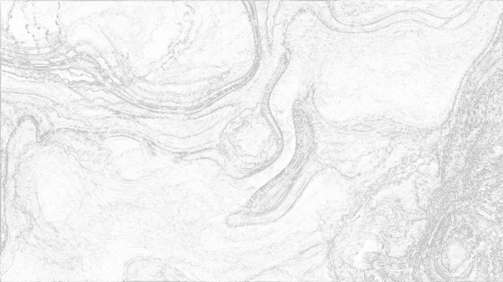

# TD Organic Patterns

TouchDesigner でフィードバックループ＋ドメインワープにより、油膜・大理石状の
有機的な虹色パターンを生成するネットワーク。

Reddit r/TouchDesigner の投稿
[organic patterns ⚗️](https://www.reddit.com/r/TouchDesigner/comments/1w3danp/organic_patterns/)
（作者: photoevaporation）の質感を、作者本人がコメントで明かした技法をもとに
TouchDesigner 標準ノードで再構築したもの。

元投稿の映像は [Reddit のオリジナル投稿](https://www.reddit.com/r/TouchDesigner/comments/1w3danp/organic_patterns/) を参照。
本リポジトリでの再現結果:


オンセット検出でシーンが切り替わる動作デモ（低域キックのたびにブレンドと色相が
ジャンプ。[フルクオリティ H.264 mp4](reference/demo_loop.mp4) も同梱）:


## 作者が明かした技法

> "It's mostly experimenting through **feedback loops** and **blend mode
> operations**. In this clip, for example, the patterns are created using
> **Emboss, Edge, and Sharpen effects inside a loop**, while I shaped the
> aesthetic through lots of blend mode operations."

## 使い方

### A. Python ビルドスクリプト（推奨・gitで差分が追える）

1. TouchDesigner を起動（空プロジェクトでよい）
2. Textport を開く（`Alt+T` / メニュー `Dialogs > Textport and DATs`）
3. [scripts/build_organic_patterns.py](scripts/build_organic_patterns.py) の中身を貼り付けて実行
4. `/project1/out1` をビューアで表示。数十フレーム回すとパターンが育つ

再実行すると既存の同名ノードを削除してから作り直すため、何度でも安全に再構築できる。

### B. .tox を読み込む

任意の COMP にドラッグ＆ドロップ。用途に応じて2種類:

- [tox/organic_patterns.tox](tox/organic_patterns.tox) — ベースのカラー版のみ（最小構成）
- [tox/organic_patterns_full.tox](tox/organic_patterns_full.tox) — 音楽反応・BPM同期・
  オンセット・MIDI/OSC・Ableton Link・小節頭アクセント・録画まで含む完全版スナップショット

（.tox はバイナリのため差分は追えない。パラメータ調整の履歴は A 側で管理する）

## パラメータバス（拡張間の式合成）

各拡張は同じパラメータ（`warp_disp.displaceweightx`、`hsv1.hueoffset` など）を
駆動する。以前は「式を丸ごと上書き」する拡張（audio_reactive / bpm_sync）と
「既存式に後置加算」する拡張（accent / midi_osc）が混在し、順序や再実行しだいで
**先に書いた項が黙って消える**事故が起きた（例: audio→accent の後に audio を再実行
すると accent 項が消える／`hueoffset` を bpm・onset・midi が奪い合う）。

これを [scripts/td_param_bus.py](scripts/td_param_bus.py) の**パラメータバス**に一本化した。
各拡張は自分の寄与を「タグ付きの加算項」として登録するだけで、バスが
`base + Σ(各タグの項)` を毎回ゼロから組み直して `.expr` に1回だけ書く。

```python
# 例: audio が彩度に高域項を、accent が小節頭パンチを、別タグで登録する
pbus.add_term(p, 'hsv1', 'saturationmult', tag='audio', term="op('aud_out')['high']*1.5", base='2.2')
pbus.add_term(p, 'hsv1', 'saturationmult', tag='accent', term="(1-...)**6*1.8")
# → hsv1.saturationmult.expr = "((2.2) + (op('aud_out')['high']*1.5)) + ((1-...)**6*1.8)"
```

- **順序非依存・再実行安全**: 合成は登録簿から毎回組み直すので、拡張をどの順で流しても、
  どれを再実行しても同じ式に収束する（同じ tag は上書き＝冪等）。
- **所有権の衝突が消える**: `hueoffset` は `bpm_hue`（小節スイープ）・`scene_hue`
  （シーンの色相基準）・`midi`（手動 k3）が別タグで共存する。onset/midi の状態機械は
  もう実行時に `hueoffset` を書き換えず、`scene_hue` 項が `scene_state` を毎フレーム
  参照して自動追従する。
- **位相ソースの自動切替**: 拍を読む項は `PHASE_SRC = "(op('beatsync') or op('beat1'))"`
  を使う。Ableton Link 拡張で `beatsync` ができた瞬間に位相ロック側へ切替わるため、
  式の張り替え（従来の `_rebind_to_beatsync`）は不要になった。
- **発散防止**: `level1.opacity`（フィードバック残留率）は `clamp=(0.0, 0.999)` 付きで
  登録し、複数タグの項が同時に乗っても 1.0 を超えて暴走しないよう合成後に締める。
- **参照切れで止まらない**: 1本の式に全タグの項を足すため、生の `op('aud_lag')['low']`
  だと `aud_lag` が1つ欠けただけで式全体がエラーになり、無関係な拍・MIDI・アクセントの
  項まで止まる。項の CHOP 参照は `pbus.ch('aud_out', 'low')`（欠損時 0）と
  `pbus.phase('rampbeat')`（位相源が無ければ 1＝拍の包絡が 0）で包む。値が正当に 0
  の拍頭を欠損と取り違えないよう、`x or 0` ではなく `is not None` で判定している。
- **フルリビルド**: `build_organic_patterns.py` が起動時に `pbus.reset()` で登録簿を
  破棄する。以降の拡張は再実行で各自のタグを登録し直す。
- 登録内容は `pbus.dump(op('/project1'))` で確認できる。契約は
  [scripts/test_td_param_bus.py](scripts/test_td_param_bus.py) が TD 無しで検証する。

> Textport 運用では各 build スクリプト冒頭のローダが `td_param_bus.py`（式の合成）と
> `td_build.py`（ノード構築）を `sys.path` 経由で読み込む（パスは `__file__`、無ければ
> 環境変数 `TD_ORGANIC_SCRIPTS` かリポジトリ既定パス）。
>
> `td_build.py` はノード作成の定型（同名を消す → 作る → 座標 → 解像度・パラメータ →
> 入力を繋ぐ）と前提ノードの確認をまとめたもの。`ensure(p, 'ctrl', 'nullCHOP', x, y,
> inputs=[mix])` のように書く。存在しないパラメータ名を渡すと警告を出す（TD の
> バージョン差を吸収しつつ、名前の打ち間違いには気づけるようにするため）。

## 拡張: 音楽反応（Audio Reactive）

ベースの油膜・大理石エンジンを音で駆動する派生。低域でドメインワープが波打ち、
中域でうねりの元エネルギーが増え、高域で金属エッジと彩度がきらめく。

1. まず [scripts/build_organic_patterns.py](scripts/build_organic_patterns.py) を実行
2. 続けて [scripts/build_audio_reactive.py](scripts/build_audio_reactive.py) を実行
3. `aud_in`（Audio Device In）のデバイスをマイク/ライン入力に設定
4. `/project1/out1` を表示して音を鳴らす

| 音の帯域 | 駆動するパラメータ | 見た目の変化 |
|---|---|---|
| 低域（キック/ベース） | `warp_disp` の変位量 | 大理石がビートで波打つ |
| 中域（コード/ボーカル） | `seed_noise` の amp | うねりの元エネルギーが増える |
| 高域（ハイハット/シンバル） | `edge1` strength ／ `hsv1` 彩度 | 金属リムと色がきらめく |
| 全体音量（RMS） | `level1` opacity | 大音量ほど構造が長く残る |

### 設計のポイント（base + gain）

各パラメータは `base + op('aud_out')['band']*gain` の式で駆動する（`aud_out` は `aud_lag`
を通すだけの出口で、慣性の拡張がここに差し込む）。無音時は解析値が
0 に収束して base 値そのまま＝元の静的パッチと同じ絵になる。マイク未接続でも壊れず、
鳴らすと動く。オーディオを「置換」でなく「加算」にすることでライブでの堅牢性を確保。

左が無音時（ベースと同一）、右がビート入力時（変位・彩度・エッジが増幅）:

| 無音（base値のみ） | ビート入力時（base + band*gain） |
|---|---|
|  |  |

- **FFT のジッタは Lag CHOP で平滑化**（attack=0.02 / release=0.15）。生の Audio
  Spectrum はフレーム毎に激しく揺れるため、そのまま繋ぐとパラメータが痙攣する。
- **帯域分割は Trim CHOP のサンプル範囲で**。Audio Spectrum の 22050 サンプルを
  低/中/高にインデックスで割る（厳密な Hz 変換より体感優先）。そのために2つの設定が要る:
  - Audio Spectrum は `frequencylog=0`（線形）。既定の 1（対数目盛り）だと 60Hz が
    5260番に出て、番号≠Hz になる。線形なら 400Hz→393番、2kHz→1997番
  - Trim は `relative='abs'`（絶対位置）。既定の `rel` だと start/end が入力の先頭/末尾
    からのずれになり、各帯域がスペクトル末尾まで丸ごと含んでしまう

  （2026-09-25 まではこの2つが効いておらず、low/mid/high がほぼ同じ値だった。
  正弦波で確認: 60Hz→low だけ、400Hz→mid だけ、2kHz→high だけが反応する。）

## 拡張: BPM同期（Beat Sync）

音楽反応が「鳴っている音のエネルギーに連続追従」なのに対し、BPM同期は先に定義した
**拍グリッドにスナップ**する。大理石が拍頭で脈動し、小節ごとに色相がスイープする。
両者は加算合成で併存でき、BPM同期だけでもフルスタックでも動く。

1. [scripts/build_organic_patterns.py](scripts/build_organic_patterns.py)（必要なら
   [scripts/build_audio_reactive.py](scripts/build_audio_reactive.py) も）を実行済みで
2. 続けて [scripts/build_bpm_sync.py](scripts/build_bpm_sync.py) を実行
3. `/local/time` の tempo（既定 120BPM）を曲に合わせる。ライブでは Tap Tempo /
   Ableton Link で上書き
4. `/project1/out1` を表示。120BPM なら 0.5 秒ごとに脈動する

| 拍要素 | 駆動するパラメータ | 見た目の変化 |
|---|---|---|
| 拍頭パルス（rampbeat） | `warp_disp` の変位量 | 拍でワープがスナップ |
| 拍頭パルス（rampbeat） | `hsv1` valuemult | 拍で明度がポップ |
| 小節ランプ（rampbar） | `hsv1` hueoffset | 小節ごとに色相スイープ |

### 設計のポイント（状態を持たない拍エンベロープ）

拍の減衰パルスは `(1 - op('beat1')['rampbeat'])**2` で式生成する。拍頭=1 →
拍末=0、二乗でアタックを鋭くする。1フレームの pulse スパイクを Lag で平滑化する
方式も試したが、スパイクは捉えづらく状態依存で不安定だった。**rampbeat 由来の
閉じた式はテンポから確定的に決まり、どのフレームでも値が一意=再現・検証が容易**。

- **Beat CHOP の bpm/pulse/rampbeat/rampbar は出力チャンネルの ON/OFF トグル**で
  あってテンポ設定ではない。実テンポはローカル Time COMP (`/local/time`) の tempo。
- **無音でも動く**（Beat CHOP は内部クロック駆動）。音量追従と違い、音がなくても
  拍は刻まれる。


## 拡張: オンセット検出でシーン切替（Onset Scenes）

連続追従（音量）・拍グリッド（BPM）に続く**イベント駆動**の第3軸。低域キックの
オンセット（立ち上がり）を検出するたびにシーンが進み、表示側ブレンドモードと色相
基準がジャンプする。曲の展開に合わせて絵の質感が切り替わる。

1. [scripts/build_organic_patterns.py](scripts/build_organic_patterns.py)（+
   [scripts/build_audio_reactive.py](scripts/build_audio_reactive.py) 推奨）を実行済みで
2. 続けて [scripts/build_onset_scenes.py](scripts/build_onset_scenes.py) を実行
3. `/project1/out1` を表示し、キック（低域）を入れる。テストは `__onsettest`
   Constant CHOP に `low=0.5` を注入すると1フレームでシーンが進む

| scene | 表示ブレンド | hue基準 | 質感 |
|---|---|---|---|
| 0 | add | 0° | 元（金属リムを加算） |
| 1 | screen | 90° | 発光的に持ち上げ |
| 2 | overlay | 180° | コントラスト強調・色相反対 |
| 3 | lightercolor | 270° | 明色優先で硬質に |

| scene 0 (add) | scene 1 (screen) | scene 2 (overlay) | scene 3 (lightercolor) |
|---|---|---|---|
|  |  |  |  |

### 設計のポイント（ヒステリシス状態機械 + ループを触らない）

- **オンセット検出はシュミットトリガ**。単純な `level > threshold` は1キックで
  閾値付近を何度も横切り多重発火する。上下2閾値（HI=0.18 発火 / LO=0.08 再武装）で
  「一度発火したら LO まで戻るまで再発火しない」＝1キック1回だけ前進を保証する。
- **状態は Execute DAT の `onFrameStart` で保持**。シーンindexは Constant CHOP、
  再武装フラグ `armed` は DAT storage（`store/fetch`）に置く。CHOP に置くとクック
  順序で競合しうるが、Python 側の永続変数なら決定的に読み書きできる。
- **シーン切替は表示側 `disp_comp` を変え、ループ内 `comp1` は触らない**。
  vividlight 等の非線形ブレンドをフィードバックループに置くと出力が 0/1 に
  張り付き崩壊する（Emboss がループを凍らせるのと同じアトラクタ問題）。ループ内は
  difference 固定、質感の切替は out 手前の表示側合成で行う。

## 拡張: MIDI/OSC 入力でライブ演奏（MIDI / OSC）

自動反応（音量・BPM・オンセット）の**上に人間の手を重ねる**半自動＝演奏の軸。
フィジカルの MIDI ノブや、スマホの TouchOSC のフェーダで、うねり・彩度・色相・
フィードバック残留などを演者がその場で突き上げる。

1. [scripts/build_organic_patterns.py](scripts/build_organic_patterns.py)（+
   audio/bpm/onset は任意）を実行済みで
2. 続けて [scripts/build_midi_osc.py](scripts/build_midi_osc.py) を実行
3. **MIDI**: `midi_map`（MIDI In Map）をダブルクリック→ Device Mapper でノブを
   `k1`..`k6` に割り当てる。**OSC**: TouchOSC を `osc_in` のポート（既定 9000）に
   向け、フェーダ名を `k1`..`k6` に合わせる
4. ハード無しでも `op('/project1/ctrl_manual').par.value0 = 0.5`（=k1）で演奏を模擬
   できる（`value0`=k1 …… `value5`=k6）。0 に戻せば効果も消える

| ノブ | 駆動するパラメータ | 演奏での使い所 |
|---|---|---|
| k1 | `warp_disp` 変位 | 盛り上がりで大理石の流れを突き上げる |
| k2 | `hsv1` 彩度 | サビで虹色イリデッセンスを強調 |
| k3 | `hsv1` 色相（度） | 手で色を回す（自動スイープに重畳） |
| k4 | `level1` opacity | フィードバック残留＝尾の長さ（発散注意で小 gain） |
| k5 | `seed_noise` 振幅 | うねりの元エネルギーを注入 |
| k6 | シーン前進（ボタン） | 任意タイミングで質感を手動ジャンプ |

### 設計のポイント（加算重畳 + fail-safe + 多重所有の解決）

- **既存式を壊さない「後置加算」**。他拡張はパラメータ式を丸ごと上書きするが、
  MIDI は `(現在の式) + op('ctrl')['kN']*gain` と後ろに足すだけ。audio/bpm の項が
  乗っていても消さず、実行順にも依存しない。無入力時は各 k が 0 なので元の絵を壊さない。
- **単一 `ctrl`（Null CHOP）を参照点に、手前で 3 ソースを加算**。`midi_map` +
  `osc_in` + `ctrl_manual`（k1..k6=0 の常在 Constant）を Math CHOP（Combine=Add）で
  同名チャンネル加算する。`ctrl_manual` が k1..k6 を必ず存在させるため、**ハードを
  繋がなくても「チャンネル無し」エラーで壊れない**。同時にテスト注入点も兼ねる。
- **多重所有パラメータの衝突を解決**。`hueoffset` は base/BPM/オンセット/MIDI の
  4 系統が寄与したい単一パラメータ。オンセット/MIDI のシーン切替は毎回 `hueoffset`
  式を再構築するため、素朴に後置加算すると**シーンが 1 度切り替わっただけで色相ノブ
  (k3) が黙って死ぬ**。そこで `_apply_scene` が式を再構築する際に `ctrl` が在れば
  k3 項を再付与する（beat1 の小節スイープ項を再付与するのと同じ流儀）。これで
  どちらの経路でシーンが進んでも手動色相が生き残る。

## 拡張: Ableton Link で実 DAW とテンポ同期（Ableton Link）

BPM同期（手打ちテンポ）を一歩進め、Ableton Live などの実 DAW と同一 LAN 上で
テンポを共有する。DAW でテンポを変えると、大理石の脈動が追従して速さを変える。
さらに**位相ロック**により、拍頭（ダウンビート）まで DAW に揃う（キックに脈動の
ピークが一致する）。

1. [scripts/build_organic_patterns.py](scripts/build_organic_patterns.py) +
   [scripts/build_bpm_sync.py](scripts/build_bpm_sync.py) を実行済みで
2. 続けて [scripts/build_ableton_link.py](scripts/build_ableton_link.py) を実行
   （オンセット/MIDI を併用する場合は、位相ロックを `_apply_scene` に行き渡らせるため
   [scripts/build_onset_scenes.py](scripts/build_onset_scenes.py) /
   [scripts/build_midi_osc.py](scripts/build_midi_osc.py) も再実行する）
3. DAW（Ableton Live 等）で Link を ON にし、TD と同一 LAN に置く
4. `ablink['numpeers']` が 1 以上・`['linked']=1` で接続成功。DAW のテンポ変更が
   `/local/time.tempo` に伝わり脈動が追従し、拍頭も DAW のダウンビートに位相ロックする
5. DAW が無くてもエンジンは 120BPM・beat1 位相で動く（fail-safe）

### 設計のポイント（/local/time を 1 点駆動 + fail-safe）

- **テンポの供給源を差し替えるだけ（ゼロ書き換え）**。beat1 の rampbeat/rampbar は
  グローバル時間 `/local/time` から確定的に決まる。その `tempo` だけを Ableton Link
  CHOP の出力へ差し替えれば、beat1・BPM脈動・オンセット・MIDI の**すべてが自動追従**
  する。個々の式に `op('ablink')` を撒かないので多重所有の衝突も起きない。
- **`tempo` パラメータは出力トグル**（Beat CHOP と同じ罠）。実テンポは出力チャンネル
  `tempo` に出る。パラメータ側はテンポ設定ではなく ON/OFF スイッチ。
- **ピア不在でも壊れない**。Ableton Link CHOP はピア 0 でも自前クロックで
  `tempo=120` を出力する。さらに保険として「`tempo>1` のときだけ追従、さもなくば
  120」の三項式にし、時計が 0 に落ちて停止する事故を防ぐ。
- **位相ロック（拍頭合わせ）も実装済み**。テンポ同期は「速さ」を合わせるが、DAW の
  ダウンビートとの「位相」までは合わない（beat1 は TD のタイムライン 0 起点）。
  厳密な拍頭合わせには `op('ablink')['rampbeat']` / `['rampbar']`（Link ネットワークに
  位相ロック済みのランプ）を読む必要がある。各式に「ablink があれば ablink、無ければ
  beat1」の三項を撒くと、`hueoffset` のように複数系統（base/bpm/onset/midi）が寄与する
  パラメータで**多重所有の衝突**（`_apply_scene` が式を再構築して他系統の項を踏み潰す）
  を再燃させる。
- **位相ソースは単一 Null `beatsync` に集約**（`ctrl` と同じ思想）。
  `beatsync_free`(beat1) と `beatsync_link`(ablink) を `beatsync_sw`(Switch) で選び、
  `beatsync`(Null) で束ねる。式側は `op('beat1')['rampbeat'|'rampbar']` を
  `op('beatsync')[...]` に張り替えるだけ。フォールバック（DAW/ablink 不在→beat1）は
  Switch の index 式 `1 if op('ablink') is not None else 0` の 1 点に集約する。
  `_apply_scene`（onset/midi）も `beatsync` 優先に更新済みで、シーン切替後も位相項と
  MIDI 手動色相 k3 項の両方が保持される（多重所有の踏み潰しが起きないことを実機で確認）。

## 拡張: 小節頭アクセント（Accent）

毎拍の連続脈動の"上"に、各小節の 1 拍目（ダウンビート）だけ一段強いパンチを
足す。構造がひと突きし、明度・彩度が跳ねる。位相ロック（Ableton Link）済みなら
このパンチは DAW のアクセント音に正確に一致する。

1. [scripts/build_organic_patterns.py](scripts/build_organic_patterns.py) +
   [scripts/build_bpm_sync.py](scripts/build_bpm_sync.py) を実行済みで
   （位相ロックまで欲しければ [scripts/build_ableton_link.py](scripts/build_ableton_link.py) も）
2. 続けて [scripts/build_accent.py](scripts/build_accent.py) を実行
3. 小節頭で構造がひと突きし、明度・彩度が一段上がる

### 設計のポイント（後置加算 + 小節頭包絡）

- **アクセント包絡は `(1 - rampbar) ** POW`**。`rampbar` は小節頭で 0・小節末で 1 の
  ランプなので、この式は**小節頭で最大→急減衰**する。`POW`（既定 6）を上げるほど
  山が鋭くなり「拍の点」に近づく（POW=6 でおよそ 1 拍かけて減衰）。
- **既存式を壊さない後置加算**。warp/hsv/opacity の式には audio/bpm/onset/MIDI/
  位相ロックの項が既に乗っている。それらを消さず末尾に `+ env*gain` を追記する。
  谷では `env≈0` なので元の絵を壊さない fail-safe。同一文字列は二重加算しない（冪等）。
- **位相ソースはビルド時に確定**。`beatsync`（位相ロック層）があればそれ、無ければ
  `beat1` を `rampbar` 供給源に選ぶ。式内に `op('beatsync') is not None` の三項を
  撒くと `_apply_scene` の多重所有問題と同種の脆さを招くため、ビルド時に 1 つに決める。
- **フィードバック opacity は極小 gain**。小節頭で構造の"尾"を伸ばせるが、大きくすると
  0/1 に張り付いて発散する（Emboss/非線形ブレンドをループに置くのと同じ問題）。
  よって opacity のアクセントだけ `gain=0.003` に抑える（無音時ピークでも 0.988 < 1.0）。

## 拡張: 音への反応に慣性（Liquid Audio）

音楽反応の平滑化（1段の Lag）のあとに、帯域ごとに定数の違う**ばね**（Spring CHOP）を
通してから映像に渡す。低域は重くゆっくり動いて少し行き過ぎて戻り、高域は軽く速く動く。
音が止まっても絵がすっと止まらず、余韻が残る。

1. [scripts/build_organic_patterns.py](scripts/build_organic_patterns.py) +
   [scripts/build_audio_reactive.py](scripts/build_audio_reactive.py) を実行済みで
2. 続けて [scripts/build_liquid_audio.py](scripts/build_liquid_audio.py) を実行
3. 比較: `op('/project1/liq_switch').par.index = 0`（慣性なし）/ `1`（慣性あり）

| 帯域 | ばね k（質量1） | 減衰 c | 減衰比 | 90%到達（実測） | 行き過ぎ（実測） |
|---|---|---|---|---|---|
| low | 40 | 7.0 | 0.55 | 0.33 秒 | 11.3% |
| mid | 150 | 14.7 | 0.60 | 0.17 秒 | 7.3% |
| high | 900 | 42 | 0.70 | 0.07 秒 | 0.1% |
| rms | （ばねなし） | — | — | 即時 | 0% |

（実測は 0/1 の矩形波を経路に流して記録したステップ応答。）

### 設計のポイント（2次の連続時間系 + 差し替え口）

- **Lag は1次、ばねは2次**。Lag は目標へ指数的に近づくだけだが、ばね
  `m·x'' + c·x' + k·x = k·u` は慣性を持ち、減衰比 ζ < 1 だと行き過ぎて戻る。
  固有振動数 `sqrt(k/m)` を帯域ごとに変えて、重さの違いを出している。
- **rms はばねに通さない**。rms は `level1.opacity`（フィードバックの残留率）を動かす。
  行き過ぎで残留率が跳ねるとループが暴走しかねないため、素通しにしている。
- **差し替え口 `aud_out`**。映像側の項は `aud_lag` ではなく `aud_out`（Null）を読む。
  この拡張は `aud_out` の入力を `liq_switch` に付け替えるだけで、音楽反応側の式には
  触らない。`build_audio_reactive.py` を再実行すると直結に戻るので、この拡張も再実行する。
- **オンセット検出は速いまま**。シーン切替は `aud_lag` を直接読むので、ばねで立ち上がりが
  鈍ってキックを取り逃すことはない。

## 拡張: 細部の層（2層目のフィードバック / Detail Layer）

ベースのループ（640×360）が作る大理石の**大きな流れ**に、1280×720 のもう1本の
ループで作る**細かい膜状の線**を重ねる。流れに沿って、等高線のような細い線が何重にも走る。

1. [scripts/build_organic_patterns.py](scripts/build_organic_patterns.py)（音で揺らすなら
   [scripts/build_audio_reactive.py](scripts/build_audio_reactive.py) も）を実行済みで
2. 続けて [scripts/build_detail_layer.py](scripts/build_detail_layer.py) を実行
3. 細部の濃さは高域（ハイハット・シンバル）で揺れる

| 合成前（disp_comp） | 合成後（detail_mix） | 足している層（det_view） |
|---|---|---|
|  |  |  |

（3枚とも同じフレームから書き出したもの。）

### 設計のポイント（ループに触らず、表示側で重ねる）

- **ベースのループには手を入れない**。1本目のループの出力 `null1` を拡大して読むだけで、
  合成は表示側の `disp_comp` と `hsv1` の間（`detail_mix`、スクリーン合成）で行う。
  ループ内に手を入れると 0/1 に張り付いて崩壊しうる（Emboss と同じ問題）。
- **構成は1本目と同じで、スケールだけ変える**。差分合成 → ドメインワープ → シャープ →
  減衰。ノイズの周期を 2.4 → 0.45、解像度を2倍、残留を 0.99 → 0.94（尾が短い）にした。
  差分の相手を「拡大した大きな流れ」にしているので、細部が流れの形に沿って出る。
- **2本目のループ自体はぼやけている**が、輪郭抽出（`det_edge`）で細い線だけを取り出して
  重ねるので問題ない。
- **濃さは音で揺れる**。`det_view.opacity = 0.35 + 高域×2.5`（0〜1にクランプ、
  パラメータバスの tag='detail'）。もっと強く見せたいときは `build_detail_layer.py` の
  base（0.35）を上げる。
- **外すときは `build_organic_patterns.py` から組み直す**（`hsv1` の入力が `disp_comp` に戻る）。

## 作例の書き出し（Recorder）

README 用の作例クリップを書き出すパイプライン。`hsv1` →
`rec_res`（480×270 に縮小）→ `rec_out`（Movie File Out）。

1. [scripts/build_recorder.py](scripts/build_recorder.py) を実行
2. `op('/project1/rec_out').par.record = True` … 数秒 … `= False`
3. `reference/demo_loop.mp4` が書き出される

### macOS のコーデック事情（ハマりどころ）

- **`h264nvgpu` は NVIDIA NVENC 専用**。Apple Silicon / Intel Mac では
  `Nvidia H.264 codec is not supported on this OS` で書き出しゼロになる。macOS は
  `mpeg4`（互換・軽量）か `prores`（高品質・大容量）を使う。
- **`gif` コーデックは容量が爆発する**（実測: 480×270 の数十秒で 100MB 超）。GIF が
  要るなら TD で mpeg4 を撮り、ffmpeg の2パスパレット最適化で軽量化するのが定石。

### ffmpeg での後処理（TD 書き出し後）

```bash
# 軽量 H.264（保存用・フルクオリティ）: 9.7MB → 1.4MB
ffmpeg -y -i demo_loop.mp4 -c:v libx264 -crf 26 -preset slow \
       -movflags +faststart -an demo_loop_h264.mp4

# README インライン用の最適化 GIF（2パスパレット）: 131MB相当 → 1.9MB
ffmpeg -y -t 8 -i demo_loop.mp4 \
  -vf "fps=10,scale=320:-1:flags=lanczos,palettegen=stats_mode=diff" \
  -update 1 _palette.png
ffmpeg -y -t 8 -i demo_loop.mp4 -i _palette.png -lavfi \
  "fps=10,scale=320:-1:flags=lanczos[x];[x][1:v]paletteuse=dither=bayer:bayer_scale=3" \
  demo_loop.gif
```

GitHub の markdown は mp4 をインライン再生しない（リンク化される）ため、動きを
見せるループは GIF が確実。フルクオリティは H.264 mp4 で別途同梱する。

## ネットワーク構成

```
seed_noise ──┐(difference)                    warp_noise
             ↓                                    │
    ┌──→ comp1 ──→ warp_disp ←────────────────────┘(変位マップ)
    │              ↓
    │        convo_sharp1 ──→ level1(decay 0.99) ──→ null1 ──┐
    │                                                  │      │
    └────────────── fb1 (feedback) ←───────────────────┘      │
                                                              │
   表示: null1 ──→ disp_level(コントラスト/黒抜き) ──┐          │
         null1 ──→ edge1(金属リム) ────────────────→ disp_comp(add) ──→ hsv1(彩度/hue回転) ──→ out1
```

| 原作の要素 | 実現しているノード / 技法 |
|---|---|
| 有機的な自己組織化 | フィードバックループ（null1 → fb1 → comp1） |
| うねる大理石の流れ | ドメインワープ（warp_noise で駆動する Displace TOP） |
| 虹色イリデッセンス | comp1 の Difference 合成 ＋ HSV hue の時間回転 |
| 金属質のエッジ | Edge TOP を Add 合成 |
| 黒い抜け・深い色調 | disp_level の blacklevel / gamma で暗部クリップ |
| 発散防止 | level1 opacity=0.99（フィードバックゲイン < 1） |

## 実装上の要点（ハマりどころ）

- **Noise TOP は `mono=False` が必須**。既定のモノクロ出力だと RGB 全チャンネルが
  同値になり、Difference 合成してもグレースケールのままになる。False にして
  RGB を分離することで初めて虹色が生まれる。
- **TD 標準の Emboss TOP はフィードバックループに置けない**。出力に +0.5 の DC
  オフセットがあり、毎フレーム系を灰色 0.5 へ引き戻す“アトラクタ”になって系が
  凍る。ループ内のエッジ強調は Convolve(シャープ化カーネル) を使い、Emboss/Edge は
  表示側に置く。
- **大理石の「流れ」は Transform の回転では出ない**（同心リング状のアーティファクト
  になる）。非剛体のうねりは Displace TOP によるドメインワープでのみ得られる。
- **色は塗るのではなく発生させる**。Difference 合成で RGB チャンネルが位相ずれし、
  油膜の補色イリデッセンスが副産物として現れる。彩度・黒は表示側で後付け。

## 調整の勘所

- 発散したら: `level1` の opacity を下げる
- 構造が固まったら: `warp_noise` の period を下げる / `seed_noise` の amp を上げる
- パターンを大きく: ループ解像度 `LR` を下げる（既定 640×360）
- 色を濃く: `hsv1` の saturationmult を上げる / `comp1` を別のブレンドモードに

## 完全一致について

作者は Patreon でパッチ（.toe）を配布していると明言している。厳密な完全再現が必要な
場合はそちらが最短。本リポジトリは作者の手法を標準ノードで再構築した教材的実装。
